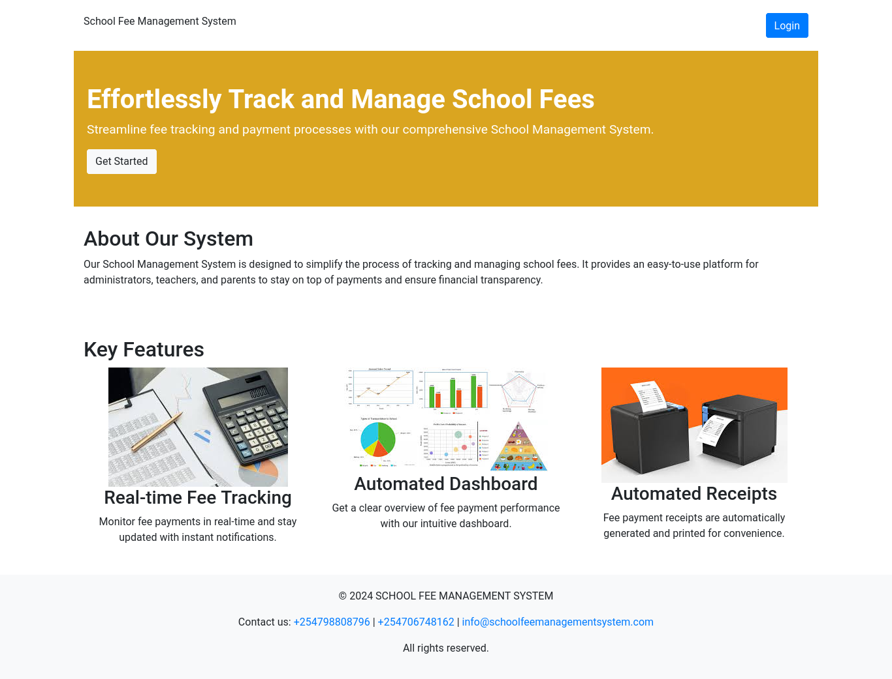

# SFMS (School Fees Management System)
SFMS was a simple project I did when I was learning to use Laravel's Filament package. I focused on the finance aspect of a school setup, defined the relevant objects, linked their relationships and eventually utilized the features of filament to actualize the project.

## Modules
- Fees Management.
- Students Management.
- School Administration.
- Role assignments using shield.

## YouTube Link:
Watch the System **[illustration video](https://www.youtube.com/watch?v=LAHG9zAEwDM)** here: [https://www.youtube.com/watch?v=LAHG9zAEwDM](https://www.youtube.com/watch?v=LAHG9zAEwDM)

# How to install
- Download the project files into a folder.
- Open terminal in the project folder. In some Linux distros, you might need to grant permissions to the project. Do so with:
 ` sudo chmod -R 755 ./`
- Install project dependencies using:
 `composer install`
- Install Node dependencies with:
 `npm install`
- Update the `.env` file.
- Generate the application key:
 `php artisan key:generate`
- Run the database server (optional for those using sqlite)
- Run laravel server 
 `php artisan serve`
- Make database migrations.
 `php artisan migrate`
- Seed the DB with the original values
 `php artisan db:seed`
- Run the jobs in the queue (optional)
 `php artisan queue:work`

 
### Enjoy the software.

# Gallery

## Dashboard (Dark)

## Dashboard (White)

## Landing Page (White)

# Special Thanks To:
- [Ukwaju Systems](https://ukwaju.systems/)
